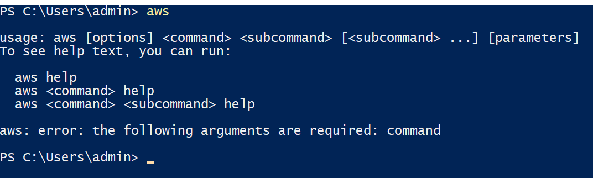
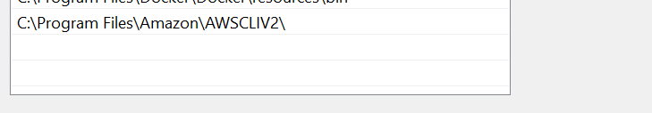
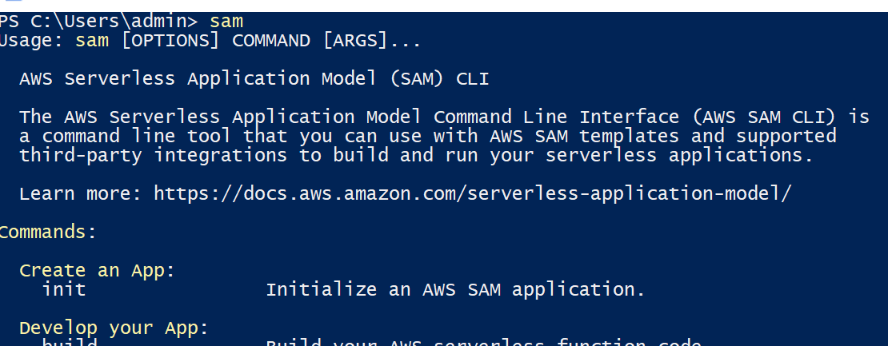
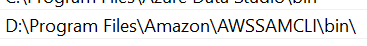

# Suggested Tools
Please see below for suggested tools, note that these are not neccessarily required for our back-end development but will greatly benefit you if you wish to run local tests before uploading changes to our repository.  

## Amazon Development Tools
Below outlines the suggested tools that will aid you in developing and testing code for the Lambda functions.  

### Amazon AWS CLI
Navigate to https://aws.amazon.com/cli/ and download the **AWS CLI V2** installer for your specific device (Windows / Mac / Linux). Click and open the  CLI installer which should be named similarly to **AWSCLIV2.msi** and run through to completion.  

_Note the above issue is only specific to Windows PCs, for MacOS user please navigate to terminal and run the suggested command._  

To ensure that CLI has installed correctly, open Powershell by either typing _Powershell_ into the search bar or pressing _Win Key + R_, typing _Powershell_ and pressing enter.
Once in Powershell type _aws_ and press enter, you should then see the following prompt:   
  

If you do not see this prompt please navigate to your environment variables and specifically look for your _path_ environment variable in system variables. Ensure that you have an enviornment variable set for the installation location of CLI similar to below:   
  

 

### Amazon AWS SAM
Navigate to https://aws.amazon.com/serverless/sam/ and download the **AWS SAM** installer for your specific device (Windows / Mac / Linux). Click and open the  CLI installer which should be named similarly to **AWS_SAM_CLI_64_PY3.msi** and run through to completion.  

_Note the above issue is only specific to Windows PCs, for MacOS user please navigate to terminal and run the suggested command._  

To ensure that CLI has installed correctly, open Powershell by either typing _Powershell_ into the search bar or pressing _Win Key + R_, typing _Powershell_ and pressing enter. Once in Powershell type _sam_ and press enter, you should then see a similar prompt to:   
  

If you do not see this prompt please navigate to your environment variables and specifically look for your _path_ environment variable in system variables. Ensure that you have an enviornment variable set for the installation location of CLI similar to below:   

 

### AWS IAM
Please accept your IAM link sent to your uowmail email address, for more information on how to set up your IAM account please [click here](./doc/IAM/SettingUpIAM.md).

 

## Other Tools
Below outlines other tools that will aid you in developing and testing.

### Docker
Docker can be installed by downloading the installer at the following link: https://www.docker.com/ and running the installer through to completion.

 

### MySQL Workbench
**_This is for database focused team members_**  
MySQL Workbench is required for Database works and can be downloaded and installed here: https://dev.mysql.com/downloads/. Note that if you wish to use another compatiable software you are more than welcome to.

 

### Liquibase
**_This is for database focused team members_**  
**COMING SOON**

 

## Frameworks / Languages
Please use Python 3.9 as that is what is supported by AWS Lambda currently, if you do not have Python 3.9 installed please navigate to the following link https://www.python.org/downloads/ and select the specific release **Python 3.9.16**.

 
 

# Some Notes
- Currently I am working on developing a dockerised version of the RDS MySQL instance along with the converting the Lambda and API Gateway into a Node.Js Express server for  local testing, but this is not yet complete.
- Currently in Amazon AWS the RDS is set to only accept inbound traffic from my own (Ben) IP, I am trying to work out a dynamic way of allowing user's IPs but we may either end up setting IPs statically in the VPC security group for selected database users or opening up traffic to all.
- I am considering the possibility of using Liquibase as version control for our database, for context historically databases have been left out of version control due to the complexity of including them in such processes but with the emergence of these new tools it is now becoming possible to have version control for live databases.