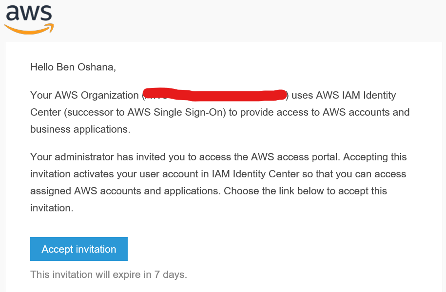
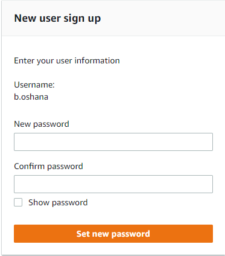
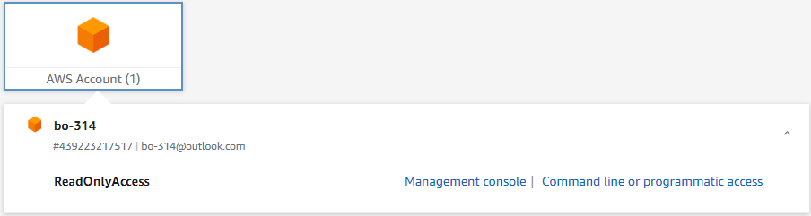
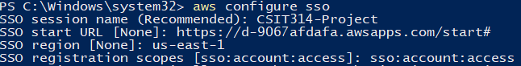
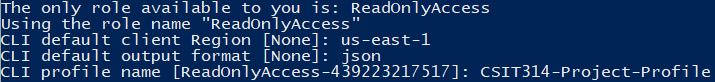
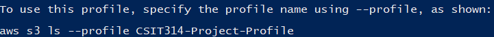

# How to Set up Your AWS IAM Account
Access email sent to you by no-reply@login.awsapps.com titled **_Invitation to join IAM Identity Center (successor to AWS Single Sign-On)_**, see below example:   
  

Please Enter in a password and click _Set new password_.   
  

Once your password has been set you will be redirected to the below login page, please enter the username that was included in your invitation email and afterwards your password.  
Once into AWS, click on **_AWS Account_** and select the available account aftwards clicking _Command line or programmatic access_. From here please enter in the SSO details following the instructions for your chosen device.   
  

_Note that the following instructions are carried out on a Windows device, while the instructions should be transferable to other device types this may not be the case, for more information please read: https://docs.aws.amazon.com/cli/latest/userguide/sso-configure-profile-token.html#sso-configure-profile-token-auto-sso  

Begin by launching **powershell** and typing `aws configure sso`, this will then generate the below prompts:
1. Fill in the **sesion name** with something similar to _CSIT314-Project_.
2. Fill in the **SSO Start URL** with the url provided when clicking on _Command line or programmatic access_.
3. Fill in the **Region** with the region provide from the same section referenced above.
4. Fill in _sso:account:access_ for **SSO Registration Scopes**.   
  

From here a link should be opened in your broswer that should be pre-filled with a code as shown in your powershell window, if it is not pre-filled please enter that code into the field in your browser.  

Afterwards you're role should be shown and the terminal will request the following fields:
1. Fill in the same region for **CLI Default Client Region**.
2. Fill in _json_ for **CLI Default Output Format**.
3. Fill in a name of your choice for **CLI Profile Name**.   
  

Finally you should see the below prompt:   
  